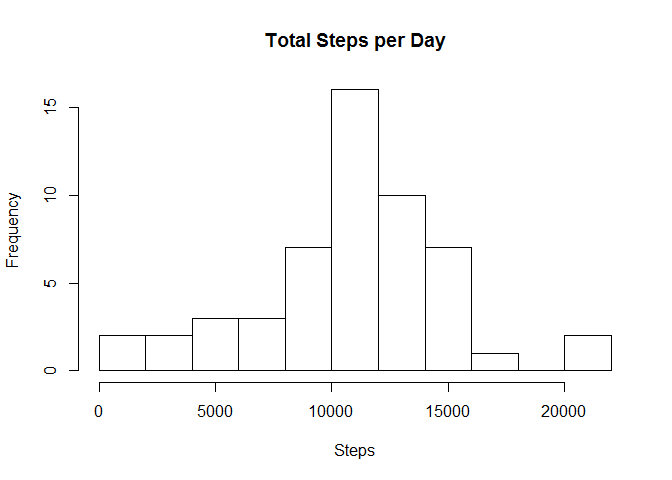
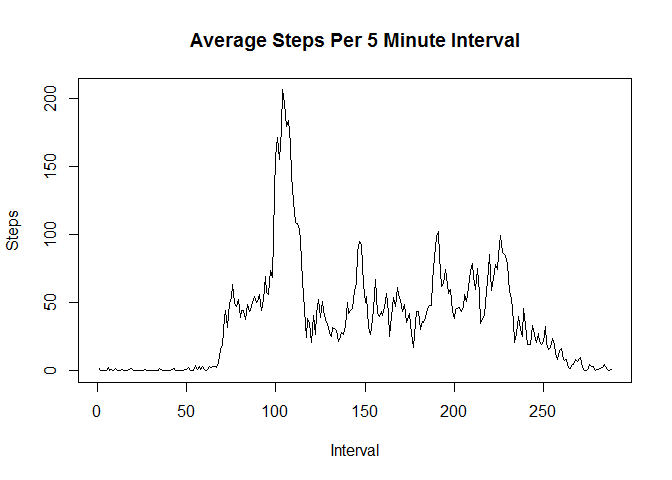
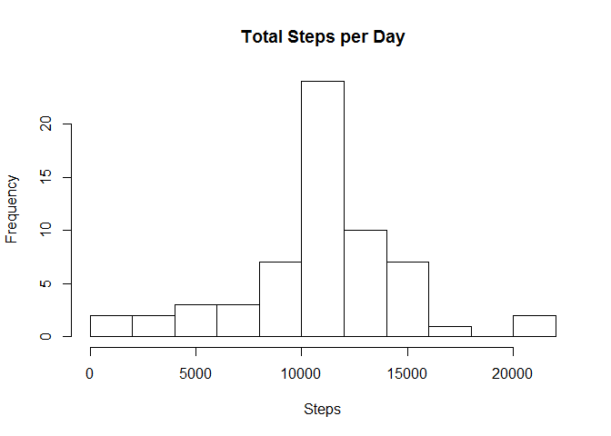
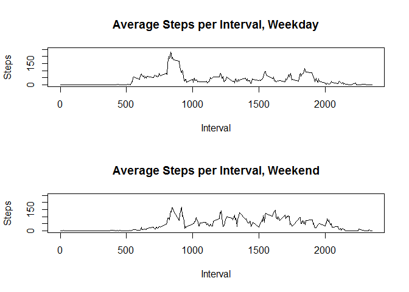

# Course Project 1
JG  
September 25, 2016  

#What is mean total number of steps taken per day?


```r
activity<-read.csv("activity.csv", header=TRUE)

daily<-with(activity, aggregate(steps, by = list(date), sum))
colnames(daily)<-c("date","steps")
hist(daily$steps, breaks=10, main="Total Steps per Day", xlab="Steps")
```

<!-- -->

```r
meansteps<-mean(daily$steps,na.rm=TRUE)
meansteps<-format(meansteps,scientific=FALSE)
meansteps<-as.integer(meansteps)
meansteps<-format(meansteps, big.mark=',')
mediansteps<-median(daily$steps,na.rm=TRUE)
mediansteps<-format(mediansteps, big.mark=',')
```

The mean number of steps per day is 10,766.
The median number of steps per day is 10,765.

#What is the average daily activity pattern?


```r
interval<-with(activity, aggregate(steps, by = list(interval), mean, na.rm=TRUE))
colnames(interval)<-c("interval","steps")
plot(interval$steps,type="l",main="Average Steps Per 5 Minute Interval", xlab="Interval", 
     ylab="Steps")
```

<!-- -->

```r
maxsteps<-max(interval$steps)
maxinterval<-interval[which.max(interval$steps),]
maxinterval$steps<-as.integer(maxinterval$steps)
maxinterval
```

```
##     interval steps
## 104      835   206
```

There is little activity early in the morning, while people are still sleeping.  There are some steps once people wake up, followed by a large spike in activity around the time of the morning commute.  Activity is somewhat consistent throughout the day and into the evening, and tapers off as people go to bed.
Interval 835 contains the maximum number of steps, at 206.

#Imputing missing values

First, the missing values are imputed with the average across the dataset for each interval.


```r
missing<-sum(is.na(activity$steps))
NAsubset<-activity[is.na(activity$steps), ]
NAfill<-merge(interval,NAsubset,by="interval")
NAfill <- subset(NAfill, select = -c(steps.y) )
colnames(NAfill)<-c("interval","steps","date")
nonNAsubset<-activity[!is.na(activity$steps), ]

FillData<-rbind(nonNAsubset,NAfill)

dailyfill<-with(FillData, aggregate(steps, by = list(date), sum, na.rm=TRUE))
colnames(dailyfill)<-c("date","steps")
hist(dailyfill$steps, breaks=10, main="Total Steps per Day", xlab="Steps")
```

<!-- -->

```r
meanstepsfill<-mean(dailyfill$steps)
meanstepsfill<-format(meanstepsfill,scientific=FALSE)
meanstepsfill<-as.integer(meanstepsfill)
meanstepsfill<-format(meanstepsfill, big.mark=',')
medianstepsfill<-median(dailyfill$steps)
medianstepsfill<-format(medianstepsfill,scientific=FALSE)
medianstepsfill<-as.integer(medianstepsfill)
medianstepsfill<-format(medianstepsfill, big.mark=',')
```

The mean number of steps per day is 10,766.
The median number of steps per day is 10,766.
Inputing values in this manner has a negligible impact on both the mean and median steps per day, since averages were used.  There are more observations around the mean.

#Are there differences in activity patterns between weekdays and weekends?


```r
library("dplyr")
```

```
## 
## Attaching package: 'dplyr'
```

```
## The following objects are masked from 'package:stats':
## 
##     filter, lag
```

```
## The following objects are masked from 'package:base':
## 
##     intersect, setdiff, setequal, union
```

```r
library("lubridate")
```

```
## 
## Attaching package: 'lubridate'
```

```
## The following object is masked from 'package:base':
## 
##     date
```

```r
library("ggplot2")
DOW<-weekdays(as.Date(FillData$date))
Weekend<-c("Saturday","Sunday")
FillData$TimeofWeek <- factor(DOW %in% Weekend, levels=c(FALSE, TRUE),
                         labels=c('Weekday', 'Weekend'))
Wknd<-subset(FillData,TimeofWeek=="Weekend")
WkndInt<-with(Wknd, aggregate(steps, by = list(interval), mean))
colnames(WkndInt)<-c("interval","steps")
Wkdy<-subset(FillData,TimeofWeek=="Weekday")
WkdyInt<-with(Wkdy, aggregate(steps, by = list(interval), mean))
colnames(WkdyInt)<-c("interval","steps")
par(mfrow=c(2,1))
plot(WkdyInt$interval,WkdyInt$steps, main="Average Steps per Interval, Weekday", xlab="Interval", 
     ylab="Steps", type="l", ylim = c(0,250))
plot(WkndInt$interval,WkndInt$steps, main="Average Steps per Interval, Weekend", xlab="Interval", 
     ylab="Steps", type="l", ylim = c(0,250))
```

<!-- -->

People tend to take more steps early in the morning on weekdays, then have a spike around the morning commute, followed by less activity through the day.  On weekends, people tend to get a later start, have more consistent activity throughout the day, and have activity later into the night.
